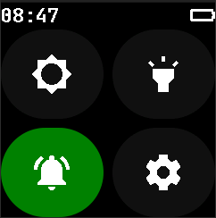
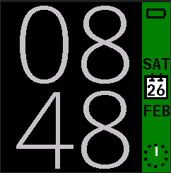

From the main font of Infinitime the Cyrillic characters are replaced with special characters of the Finnish, Swedish and Polish languages.

This helps you when you are using GadgetBridge as a companion app. You can turn off transliteration and enjoy perfectly readable notifications. 

The font modification is first tested on InfiniSim and then on my personal sealed pinetime, before it's uploaded here. So you can be pretty sure that it works.

There are two versions that you can try:

First one is pure Infinitime with updated special characters (FI, SE, PL)

[pinetime-mcuboot-app-dfu-1.8.0-FI-SE-PL](https://github.com/tomechio/Infinitime_FI_SE_PL_support/releases/download/InfiniTime/pinetime-mcuboot-app-dfu-1.8.0-FI-SE-PL.zip)

Second one is my personal modification with these changes:

[pinetime-mcuboot-app-dfu-1.8.0-FI-SE-PL-mod](https://github.com/tomechio/Infinitime_FI_SE_PL_support/releases/download/InfiniTime/pinetime-mcuboot-app-dfu-1.8.0-FI-SE-PL-mod.zip)

- support for FI, SE, PL special characters
- 10% bigger main font 20px -> 22px
- notification texts are changed from yellow to white
- Aqua blue color in menus is changed to gray
- the shape of the buttons is more rounded

 
 
 
 
 
 
